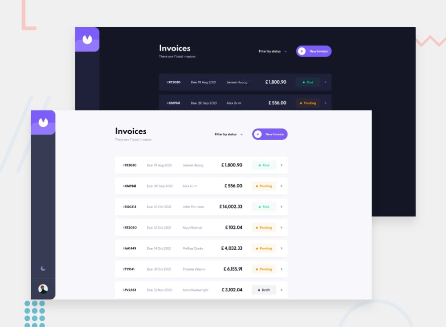

# Frontend Mentor - Invoice app :construction:

This is a solution to the Invoice app challenge on Frontend Mentor. Frontend Mentor challenges help you improve your coding skills by building realistic projects.

## Table of contents

- [Overview](#overview)
  - [The challenge](#the-challenge)
  - [Screenshot](#screenshot)
  - [Links](#links)
- [My process](#my-process)
  - [Built with](#built-with)
- [Author](#author)

## Overview

### The challenge

Users should be able to:

- View the optimal layout for the app depending on their device's screen size
- See hover states for all interactive elements on the page
- Create, read, update, and delete invoices
- Receive form validations when trying to create/edit an invoice
- Save draft invoices, and mark pending invoices as paid
- Filter invoices by status (draft/pending/paid)
- Toggle light and dark mode
- Bonus: Keep track of any changes, even after refreshing the browser (localStorage could be used for this if you're not building out a full-stack app)

### Screenshot

### Links

- Solution URL: Work in progress :construction:
- Live Site URL: Soon

## My process

### Built with

- [Next.js](https://nextjs.org/) - React framework
- [Sass Modules](https://sass-lang.com/) - For styles
- [TypeScript](https://www.typescriptlang.org/) - TypeScript
- [PostgreSQL](https://www.postgresql.org/) - Database management system
- [Prisma](https://www.prisma.io/) - ORM
  -- - [Heroku](https://www.heroku.com/) - Cloud platform--
- [Supabase](https://supabase.com/) - Cloud platform

### Author

- Frontend Mentor - [@MaxDeb1](https://www.frontendmentor.io/profile/MaxDeb1)
- Twitter - [@0xmaxdeb1](https://www.twitter.com/0xmaxdeb1)
